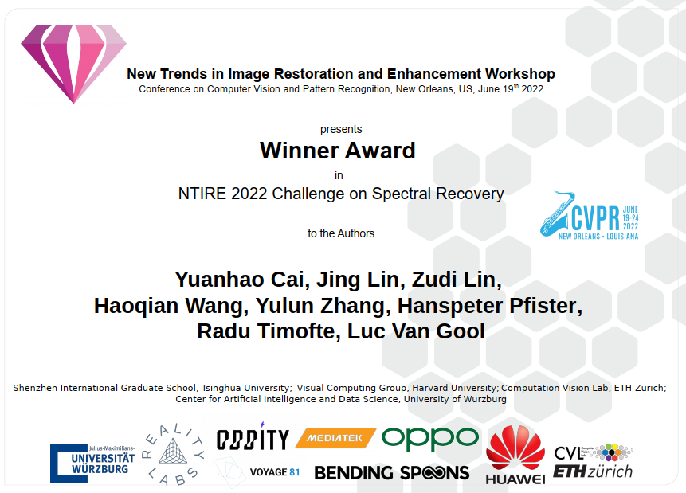
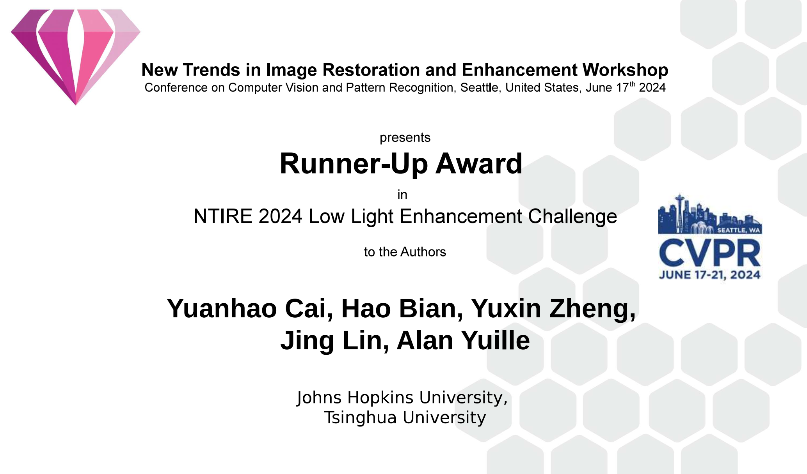
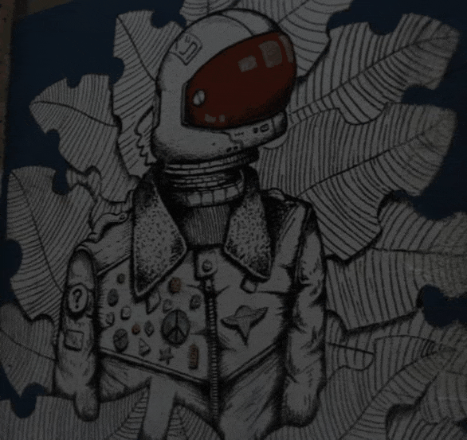

[](https://paperswithcode.com/sota/spectral-reconstruction-on-arad-1k?p=mst-multi-stage-spectral-wise-transformer-for)
[](https://paperswithcode.com/sota/spectral-reconstruction-on-cave?p=degradation-aware-unfolding-half-shuffle)

[](https://paperswithcode.com/sota/spectral-reconstruction-on-kaist?p=degradation-aware-unfolding-half-shuffle)
[](https://paperswithcode.com/sota/spectral-reconstruction-on-real-hsi?p=degradation-aware-unfolding-half-shuffle)


# MST++: Multi-stage Spectral-wise Transformer for Efficient Spectral Reconstruction (CVPRW 2022)
[](https://codalab.lisn.upsaclay.fr/competitions/721#learn_the_details)
[](https://arxiv.org/abs/2204.07908)
[](https://zhuanlan.zhihu.com/p/501101943)
[](https://github.com/caiyuanhao1998/MST)

Yuanhao Cai, Jing Lin, Zudi Lin, Haoqian Wang, Yulun Zhang, Hanspeter Pfister, Radu Timofte, Luc Van Gool

*The first two authors contribute equally to this work*

 

#### News
- **2024.03.21 :** Our methods [Retinexformer](https://github.com/caiyuanhao1998/Retinexformer) and [MST++](https://github.com/caiyuanhao1998/MST-plus-plus) (NTIRE 2022 Spectral Reconstruction Challenge Winner) ranked top-2 in the [NTIRE 2024 Challenge on Low Light Enhancement](https://codalab.lisn.upsaclay.fr/competitions/17640). Code, pre-trained models, training logs, and enhancement results will be released in [the repo of Retinexformer](https://github.com/caiyuanhao1998/Retinexformer). Stay tuned! 🚀
- **2024.02.15 :** [NTIRE 2024 Challenge on Low Light Enhancement](https://codalab.lisn.upsaclay.fr/competitions/17640) begins. Welcome to use our [Retinexformer](https://github.com/caiyuanhao1998/Retinexformer) or [MST++](https://github.com/caiyuanhao1998/MST-plus-plus) (NTIRE 2022 Spectral Reconstruction Challenge Winner) to participate in this challenge! :trophy:
- **2023.11.02 :** Our MST++ is added to the [Awesome-Transformer-Attention](https://github.com/cmhungsteve/Awesome-Transformer-Attention/blob/main/README_2.md#image-restoration) collection. 💫
- **2022.10.24 :** We have provided Params and FLOPS evaluating function. Feel free to check and use them.
- **2022.10.23 :** We have provided some visualization tool functions. Please feel free to check and use them.
- **2022.04.17 :** Our paper has been accepted by CVPRW 2022, code and models have been released. :rocket: 
- **2022.04.02 :** We win the **First** place of NTIRE 2022 Challenge on Spectral Reconstruction from RGB. :trophy: 

|             480 nm              |              520 nm              |              580 nm              |              660 nm              |
| :-----------------------------: | :------------------------------: | :------------------------------: | :------------------------------: |
|  |  |  |   |


<hr />

> **Abstract:** *Existing leading methods for spectral reconstruction (SR) focus on designing deeper or wider convolutional neural networks (CNNs) to learn the end-to-end mapping from the RGB image to its hyperspectral image (HSI). These CNN-based methods achieve impressive restoration performance while showing limitations in capturing the long-range dependencies and self-similarity prior. To cope with this problem, we propose a novel Transformer-based method, Multi-stage Spectral-wise Transformer (MST++),  for efficient spectral reconstruction. In particular, we employ Spectral-wise Multi-head Self-attention (S-MSA) that is based on the HSI spatially sparse while spectrally self-similar nature to compose the basic unit, Spectral-wise Attention Block (SAB). Then SABs build up Single-stage Spectral-wise Transformer (SST) that exploits a U-shaped structure to extract multi-resolution contextual information. Finally, our MST++, cascaded by several SSTs, progressively improves the reconstruction quality from coarse to fine. Comprehensive experiments show that our MST++ significantly outperforms other state-of-the-art methods. In the NTIRE 2022 Spectral Reconstruction Challenge, our approach won the First place.* 
<hr />


## Network Architecture


Our MST++ is mainly based on our work [MST](https://github.com/caiyuanhao1998/MST), which is accepted by CVPR 2022.

## Comparison with State-of-the-art Methods
This repo is a baseline and toolbox containing 11 image restoration algorithms for Spectral Reconstruction.

We are going to enlarge our model zoo in the future.


<details open>
<summary><b>Supported algorithms:</b></summary>

* [x] [MST++](https://arxiv.org/abs/2111.07910) (CVPRW 2022)
* [x] [MST](https://arxiv.org/abs/2111.07910) (CVPR 2022)
* [x] [HDNet](https://arxiv.org/abs/2203.02149) (CVPR 2022)
* [x] [Restormer](https://arxiv.org/abs/2111.09881) (CVPR 2022)
* [x] [MPRNet](https://arxiv.org/abs/2102.02808) (CVPR 2021)
* [x] [HINet](https://arxiv.org/abs/2105.06086) (CVPRW 2021)
* [x] [MIRNet](https://arxiv.org/abs/2003.06792) (ECCV 2020)
* [x] [AWAN](https://arxiv.org/abs/2005.09305) (CVPRW 2020)
* [x] [HRNet](https://arxiv.org/abs/2005.04703) (CVPRW 2020)
* [x] [HSCNN+](https://openaccess.thecvf.com/content_cvpr_2018_workshops/w13/html/Shi_HSCNN_Advanced_CNN-Based_CVPR_2018_paper.html) (CVPRW 2018)
* [x] [EDSR](https://arxiv.org/abs/1707.02921) (CVPRW 2017)

</details>


### Results on NTIRE 2022 HSI Dataset - Validation
|  Method   | Params (M) | FLOPS (G) |    MRAE    |    RMSE    |   PSNR    |  Model Zoo   |
| :-------: | :--------: | :-------: | :--------: | :--------: | :-------: | :----------: |
|  [HSCNN+](https://openaccess.thecvf.com/content_cvpr_2018_workshops/w13/html/Shi_HSCNN_Advanced_CNN-Based_CVPR_2018_paper.html)   |    4.65    |  304.45   |   0.3814   |   0.0588   |   26.36   | [Google Drive](https://drive.google.com/file/d/1DqeTNNYaIKodCQWrhclVO3bXw1r4OAxJ/view?usp=sharing) / [Baidu Disk](https://pan.baidu.com/s/1VebfZFZCNxeT44IE5GtLsg)|
|   [HRNet](https://arxiv.org/abs/2005.04703)   |   31.70    |  163.81   |   0.3476   |   0.0550   |   26.89   | [Google Drive](https://drive.google.com/file/d/1RZXtCj7q_80xUT59UmdoFPP3g1YDND02/view?usp=sharing) / [Baidu Disk](https://pan.baidu.com/s/1gf0jtZfTNgMG7u-Jm3WQDw) |
|   [EDSR](https://arxiv.org/abs/1707.02921)    |    2.42    |  158.32   |   0.3277   |   0.0437   |   28.29   | [Google Drive](https://drive.google.com/file/d/1b2DyuxEr8u2_3mnM-dOWjz_YH8XK8ir3/view?usp=sharing) / [Baidu Disk](https://pan.baidu.com/s/1R1xpN2dzm31eMR5Fw-SL1A) |
|   [AWAN](https://arxiv.org/abs/2005.09305)    |    4.04    |  270.61   |   0.2500   |   0.0367   |   31.22   | [Google Drive](https://drive.google.com/file/d/1M16NrkHcGdzh9fu0NAdRXIMfCK3xQyy0/view?usp=sharing) / [Baidu Disk](https://pan.baidu.com/s/12U8F9YAh9HzykPbCuOJWBA) |
|   [HDNet](https://arxiv.org/abs/2203.02149)   |    2.66    |  173.81   |   0.2048   |   0.0317   |   32.13   | [Google Drive](https://drive.google.com/file/d/1HYWUplVkCgHznuInVeghYisdJuNqSr4z/view?usp=sharing) / [Baidu Disk](https://pan.baidu.com/s/1xsRcS4tFxB9NL6DAeUgivg?pwd=rqrb) |
|   [HINet](https://arxiv.org/abs/2105.06086)   |    5.21    |   31.04   |   0.2032   |   0.0303   |   32.51   | [Google Drive](https://drive.google.com/file/d/1dOczPBwz6ZCcBCuRG7L7aJdfT4nCb1nx/view?usp=sharing) / [Baidu Disk](https://pan.baidu.com/s/16QMyRxnXjgx6wCg8kZr4Ww) |
|  [MIRNet](https://arxiv.org/abs/2003.06792)   |    3.75    |   42.95   |   0.1890   |   0.0274   |   33.29   | [Google Drive](https://drive.google.com/file/d/1Vndgr3csKZp624NtYWiSp8FTikDy8O6Q/view?usp=sharing) / [Baidu Disk](https://pan.baidu.com/s/1W63FiCaP1VDfwcKBIWB55w) |
| [Restormer](https://arxiv.org/abs/2111.09881) |   15.11    |   93.77   |   0.1833   |   0.0274   |   33.40   | [Google Drive](https://drive.google.com/file/d/1tDwe9X46bfaRrdTnQi4q2ZPnwssA5B2A/view?usp=sharing) / [Baidu Disk](https://pan.baidu.com/s/1Y9uggzjOGXcuPj92QnRRnw) |
|  [MPRNet](https://arxiv.org/abs/2102.02808)   |    3.62    |  101.59   |   0.1817   |   0.0270   |   33.50   | [Google Drive](https://drive.google.com/file/d/1amYEpxlBnT1pmk7JmKWYT_bi7WAJH-ad/view?usp=sharing) / [Baidu Disk](https://pan.baidu.com/s/1CZYtmNj2tE30KmWM8em7gg) |
|   [MST-L](https://arxiv.org/abs/2111.07910)   |    2.45    |   32.07   |   0.1772   |   0.0256   |   33.90   | [Google Drive](https://drive.google.com/file/d/17dMffhghFf7nZIqR_f8fNY7Kqh_Xm4Vw/view?usp=sharing) / [Baidu Disk](https://pan.baidu.com/s/1X1ICPhJuX91RpEkAQykYGQ) |
| [**MST++**](https://arxiv.org/abs/2111.07910) |  **1.62**  | **23.05** | **0.1645** | **0.0248** | **34.32** | [Google Drive](https://drive.google.com/file/d/18X6RkcQaIuiV5gRbswo7GLv7WJG9M_WM/view?usp=sharing) / [Baidu Disk](https://pan.baidu.com/s/1FOZMNO2dwwZyRBKYUv12HA) |

Our MST++ siginificantly outperforms other methods while requiring cheaper Params and FLOPS.

Note: access code for `Baidu Disk` is `mst1`.

## 1. Create Envirement:

- Python 3 (Recommend to use [Anaconda](https://www.anaconda.com/download/#linux))

- NVIDIA GPU + [CUDA](https://developer.nvidia.com/cuda-downloads)

- Python packages:

  ```shell
  cd MST-plus-plus
  pip install -r requirements.txt
  ```

## 2. Data Preparation:

- Download training spectral images ([Google Drive](https://drive.google.com/file/d/1FQBfDd248dCKClR-BpX5V2drSbeyhKcq/view) / [Baidu Disk](https://pan.baidu.com/s/1NisQ6NjGvVhc0iOLH7OFvg), code: `mst1`), training RGB images ([Google Drive](https://drive.google.com/file/d/1A4GUXhVc5k5d_79gNvokEtVPG290qVkd/view) / [Baidu Disk](https://pan.baidu.com/s/1k7aSSL5MMipWYszlFaBLkA)),  validation spectral images ([Google Drive](https://drive.google.com/file/d/12QY8LHab3gzljZc3V6UyHgBee48wh9un/view) / [Baidu Disk](https://pan.baidu.com/s/1CIb5AqLWJxaGilTPtmWl0A)), validation RGB images ([Google Drive](https://drive.google.com/file/d/19vBR_8Il1qcaEZsK42aGfvg5lCuvLh1A/view) / [Baidu Disk](https://pan.baidu.com/s/1YakbXgBgnhNmYoxySmZaGw)), and testing RGB images ([Google Drive](https://drive.google.com/file/d/1A5309Gk7kNFI-ORyADueiPOCMQNTA7r5/view) / [Baidu Disk](https://pan.baidu.com/s/1RXHK64mUfK_GeeoLzqAmeQ)) from the [competition website](https://codalab.lisn.upsaclay.fr/competitions/721#participate-get_data) of NTIRE 2022 Spectral Reconstruction Challenge.

- Place the training spectral images and validation spectral images to `/MST-plus-plus/dataset/Train_Spec/`.

- Place the training RGB images and validation RGB images to `/MST-plus-plus/dataset/Train_RGB/`.

- Place the testing RGB images  to `/MST-plus-plus/dataset/Test_RGB/`.

- Then this repo is collected as the following form:

  ```shell
  |--MST-plus-plus
      |--test_challenge_code
      |--test_develop_code
      |--train_code  
      |--dataset 
          |--Train_Spec
              |--ARAD_1K_0001.mat
              |--ARAD_1K_0002.mat
              ： 
              |--ARAD_1K_0950.mat
		|--Train_RGB
              |--ARAD_1K_0001.jpg
              |--ARAD_1K_0002.jpg
              ： 
              |--ARAD_1K_0950.jpg
          |--Test_RGB
              |--ARAD_1K_0951.jpg
              |--ARAD_1K_0952.jpg
              ： 
              |--ARAD_1K_1000.jpg
          |--split_txt
              |--train_list.txt
              |--valid_list.txt
  ```

## 3. Evaluation on the Validation Set:

(1)  Download the pretrained model zoo from ([Google Drive](https://drive.google.com/drive/folders/1G1GOA0FthtmOERJIJ0pALOSgXc6XOfoY?usp=sharing) / [Baidu Disk](https://pan.baidu.com/s/14L6T5SsUejepsc63XS9Xsw), code: `mst1`) and place them to `/MST-plus-plus/test_develop_code/model_zoo/`. 

(2)  Run the following command to test the model on the validation RGB images. 

```shell
cd /MST-plus-plus/test_develop_code/

# test MST++
python test.py --data_root ../dataset/  --method mst_plus_plus --pretrained_model_path ./model_zoo/mst_plus_plus.pth --outf ./exp/mst_plus_plus/  --gpu_id 0

# test MST-L
python test.py --data_root ../dataset/  --method mst --pretrained_model_path ./model_zoo/mst.pth --outf ./exp/mst/  --gpu_id 0

# test MIRNet
python test.py --data_root ../dataset/  --method mirnet --pretrained_model_path ./model_zoo/mirnet.pth --outf ./exp/mirnet/  --gpu_id 0

# test HINet
python test.py --data_root ../dataset/  --method hinet --pretrained_model_path ./model_zoo/hinet.pth --outf ./exp/hinet/  --gpu_id 0

# test MPRNet
python test.py --data_root ../dataset/  --method mprnet --pretrained_model_path ./model_zoo/mprnet.pth --outf ./exp/mprnet/  --gpu_id 0

# test Restormer
python test.py --data_root ../dataset/  --method restormer --pretrained_model_path ./model_zoo/restormer.pth --outf ./exp/restormer/  --gpu_id 0

# test EDSR
python test.py --data_root ../dataset/  --method edsr --pretrained_model_path ./model_zoo/edsr.pth --outf ./exp/edsr/  --gpu_id 0

# test HDNet
python test.py --data_root ../dataset/  --method hdnet --pretrained_model_path ./model_zoo/hdnet.pth --outf ./exp/hdnet/  --gpu_id 0

# test HRNet
python test.py --data_root ../dataset/  --method hrnet --pretrained_model_path ./model_zoo/hrnet.pth --outf ./exp/hrnet/  --gpu_id 0

# test HSCNN+
python test.py --data_root ../dataset/  --method hscnn_plus --pretrained_model_path ./model_zoo/hscnn_plus.pth --outf ./exp/hscnn_plus/  --gpu_id 0

# test AWAN
python test.py --data_root ../dataset/  --method awan --pretrained_model_path ./model_zoo/awan.pth --outf ./exp/awan/  --gpu_id 0
```

The results will be saved in `/MST-plus-plus/test_develop_code/exp/` in the mat format and the evaluation metric (including MRAE,RMSE,PSNR) will be printed.

- #### Evaluating the Params and FLOPS of models
We have provided a function `my_summary()` in `test_develop_code/utils.py`, please use this function to evaluate the parameters and computational complexity of the models, especially the Transformers as

```shell
from utils import my_summary
my_summary(MST_Plus_Plus(), 256, 256, 3, 1)
```

## 4. Evaluation on the Test Set:

(1)  Download the pretrained model zoo from ([Google Drive](https://drive.google.com/drive/folders/1G1GOA0FthtmOERJIJ0pALOSgXc6XOfoY?usp=sharing) / [Baidu Disk](https://pan.baidu.com/s/14L6T5SsUejepsc63XS9Xsw), code: `mst1`) and place them to `/MST-plus-plus/test_challenge_code/model_zoo/`. 

(2)  Run the following command to test the model on the testing RGB images. 

```shell
cd /MST-plus-plus/test_challenge_code/

# test MST++
python test.py --data_root ../dataset/  --method mst_plus_plus --pretrained_model_path ./model_zoo/mst_plus_plus.pth --outf ./exp/mst_plus_plus/  --gpu_id 0

# test MST-L
python test.py --data_root ../dataset/  --method mst --pretrained_model_path ./model_zoo/mst.pth --outf ./exp/mst/  --gpu_id 0

# test MIRNet
python test.py --data_root ../dataset/  --method mirnet --pretrained_model_path ./model_zoo/mirnet.pth --outf ./exp/mirnet/  --gpu_id 0

# test HINet
python test.py --data_root ../dataset/  --method hinet --pretrained_model_path ./model_zoo/hinet.pth --outf ./exp/hinet/  --gpu_id 0

# test MPRNet
python test.py --data_root ../dataset/  --method mprnet --pretrained_model_path ./model_zoo/mprnet.pth --outf ./exp/mprnet/  --gpu_id 0

# test Restormer
python test.py --data_root ../dataset/  --method restormer --pretrained_model_path ./model_zoo/restormer.pth --outf ./exp/restormer/  --gpu_id 0

# test EDSR
python test.py --data_root ../dataset/  --method edsr --pretrained_model_path ./model_zoo/edsr.pth --outf ./exp/edsr/  --gpu_id 0

# test HDNet
python test.py --data_root ../dataset/  --method hdnet --pretrained_model_path ./model_zoo/hdnet.pth --outf ./exp/hdnet/  --gpu_id 0

# test HRNet
python test.py --data_root ../dataset/  --method hrnet --pretrained_model_path ./model_zoo/hrnet.pth --outf ./exp/hrnet/  --gpu_id 0

# test HSCNN+
python test.py --data_root ../dataset/  --method hscnn_plus --pretrained_model_path ./model_zoo/hscnn_plus.pth --outf ./exp/hscnn_plus/  --gpu_id 0
```

The results and submission.zip will be saved in `/MST-plus-plus/test_challenge_code/exp/`.

## 5. Training

To train a model, run

```shell
cd /MST-plus-plus/train_code/

# train MST++
python train.py --method mst_plus_plus  --batch_size 20 --end_epoch 300 --init_lr 4e-4 --outf ./exp/mst_plus_plus/ --data_root ../dataset/  --patch_size 128 --stride 8  --gpu_id 0

# train MST-L
python train.py --method mst  --batch_size 20 --end_epoch 300 --init_lr 4e-4 --outf ./exp/mst/ --data_root ../dataset/  --patch_size 128 --stride 8  --gpu_id 0

# train MIRNet
python train.py --method mirnet  --batch_size 20 --end_epoch 300 --init_lr 4e-4 --outf ./exp/mirnet/ --data_root ../dataset/  --patch_size 128 --stride 8  --gpu_id 0

# train HINet
python train.py --method hinet  --batch_size 20 --end_epoch 300 --init_lr 2e-4 --outf ./exp/hinet/ --data_root ../dataset/  --patch_size 128 --stride 8  --gpu_id 0

# train MPRNet
python train.py --method mprnet  --batch_size 20 --end_epoch 300 --init_lr 2e-4 --outf ./exp/mprnet/ --data_root ../dataset/  --patch_size 128 --stride 8  --gpu_id 0

# train Restormer
python train.py --method restormer  --batch_size 20 --end_epoch 300 --init_lr 2e-4 --outf ./exp/restormer/ --data_root ../dataset/  --patch_size 128 --stride 8  --gpu_id 0

# train EDSR
python train.py --method edsr  --batch_size 20 --end_epoch 300 --init_lr 1e-4 --outf ./exp/edsr/ --data_root ../dataset/  --patch_size 128 --stride 8  --gpu_id 0

# train HDNet
python train.py --method hdnet  --batch_size 20 --end_epoch 300 --init_lr 4e-4 --outf ./exp/hdnet/ --data_root ../dataset/  --patch_size 128 --stride 8  --gpu_id 0

# train HRNet
python train.py --method hrnet  --batch_size 20 --end_epoch 300 --init_lr 1e-4 --outf ./exp/hrnet/ --data_root ../dataset/  --patch_size 128 --stride 8  --gpu_id 0

# train HSCNN+
python train.py --method hscnn_plus  --batch_size 20 --end_epoch 300 --init_lr 2e-4 --outf ./exp/hscnn_plus/ --data_root ../dataset/  --patch_size 128 --stride 8  --gpu_id 0

# train AWAN
python train.py --method awan  --batch_size 20 --end_epoch 300 --init_lr 1e-4 --outf ./exp/awan/ --data_root ../dataset/  --patch_size 128 --stride 8  --gpu_id 0
```

The training log and models will be saved in `/MST-plus-plus/train_code/exp/`.

## 6. Prediction

(1)  Download the pretrained model zoo from ([Google Drive](https://drive.google.com/drive/folders/1G1GOA0FthtmOERJIJ0pALOSgXc6XOfoY?usp=sharing) / [Baidu Disk](https://pan.baidu.com/s/14L6T5SsUejepsc63XS9Xsw), code: `mst1`) and place them to `/MST-plus-plus/predict_code/model_zoo/`. 

(2)  Run the following command to reconstruct your own RGB image. 

```shell
cd /MST-plus-plus/predict_code/

# reconstruct by MST++
python test.py --rgb_path ./demo/ARAD_1K_0912.jpg  --method mst_plus_plus --pretrained_model_path ./model_zoo/mst_plus_plus.pth --outf ./exp/mst_plus_plus/  --gpu_id 0

# reconstruct by MST-L
python test.py --rgb_path ./demo/ARAD_1K_0912.jpg  --method mst --pretrained_model_path ./model_zoo/mst.pth --outf ./exp/mst/  --gpu_id 0

# reconstruct by MIRNet
python test.py --rgb_path ./demo/ARAD_1K_0912.jpg  --method mirnet --pretrained_model_path ./model_zoo/mirnet.pth --outf ./exp/mirnet/  --gpu_id 0

# reconstruct by HINet
python test.py --rgb_path ./demo/ARAD_1K_0912.jpg  --method hinet --pretrained_model_path ./model_zoo/hinet.pth --outf ./exp/hinet/  --gpu_id 0

# reconstruct by MPRNet
python test.py --rgb_path ./demo/ARAD_1K_0912.jpg  --method mprnet --pretrained_model_path ./model_zoo/mprnet.pth --outf ./exp/mprnet/  --gpu_id 0

# reconstruct by Restormer
python test.py --rgb_path ./demo/ARAD_1K_0912.jpg  --method restormer --pretrained_model_path ./model_zoo/restormer.pth --outf ./exp/restormer/  --gpu_id 0

# reconstruct by EDSR
python test.py --rgb_path ./demo/ARAD_1K_0912.jpg --method edsr --pretrained_model_path ./model_zoo/edsr.pth --outf ./exp/edsr/  --gpu_id 0

# reconstruct by HDNet
python test.py --rgb_path ./demo/ARAD_1K_0912.jpg  --method hdnet --pretrained_model_path ./model_zoo/hdnet.pth --outf ./exp/hdnet/  --gpu_id 0

# reconstruct by HRNet
python test.py --rgb_path ./demo/ARAD_1K_0912.jpg  --method hrnet --pretrained_model_path ./model_zoo/hrnet.pth --outf ./exp/hrnet/  --gpu_id 0

# reconstruct by HSCNN+
python test.py --rgb_path ./demo/ARAD_1K_0912.jpg  --method hscnn_plus --pretrained_model_path ./model_zoo/hscnn_plus.pth --outf ./exp/hscnn_plus/  --gpu_id 0
```

You can replace './demo/ARAD_1K_0912.jpg' with your RGB image path. The reconstructed results will be saved in `/MST-plus-plus/predict_code/exp/`.

## 7. Visualization
- Put the reconstruted HSI in `visualization/simulation_results/results/`.

- Generate the RGB images of the reconstructed HSIs


```shell
cd visualization/
Run show_simulation.m
```

## Citation
If this repo helps you, please consider citing our works:

```shell

# MST
@inproceedings{mst,
  title={Mask-guided Spectral-wise Transformer for Efficient Hyperspectral Image Reconstruction},
  author={Yuanhao Cai and Jing Lin and Xiaowan Hu and Haoqian Wang and Xin Yuan and Yulun Zhang and Radu Timofte and Luc Van Gool},
  booktitle={CVPR},
  year={2022}
}


# MST++
@inproceedings{mst_pp,
  title={MST++: Multi-stage Spectral-wise Transformer for Efficient Spectral Reconstruction},
  author={Yuanhao Cai and Jing Lin and Zudi Lin and Haoqian Wang and Yulun Zhang and Hanspeter Pfister and Radu Timofte and Luc Van Gool},
  booktitle={CVPRW},
  year={2022}
}


# HDNet
@inproceedings{hdnet,
  title={HDNet: High-resolution Dual-domain Learning for Spectral Compressive Imaging},
  author={Xiaowan Hu and Yuanhao Cai and Jing Lin and  Haoqian Wang and Xin Yuan and Yulun Zhang and Radu Timofte and Luc Van Gool},
  booktitle={CVPR},
  year={2022}
}

```
